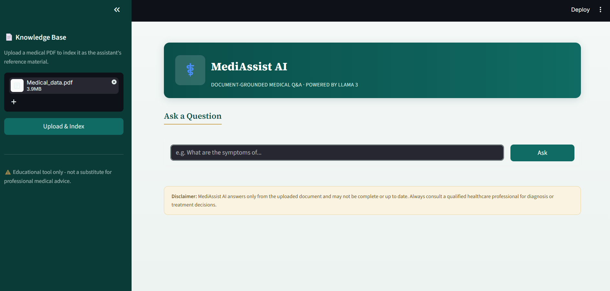
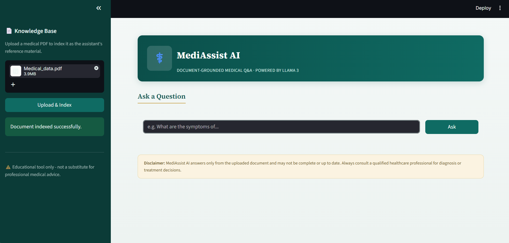
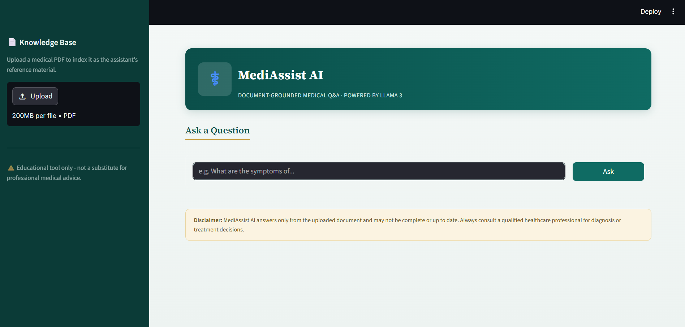
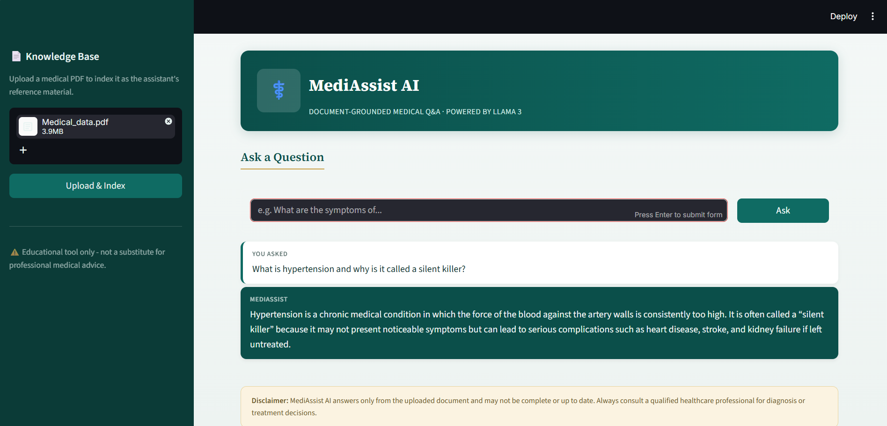

# 🩺 AI Medical Assistant (Bedrock + Llama 3 + RAG)

[](LICENSE)
[](https://www.python.org/)
[](https://fastapi.tiangolo.com/)
[](https://streamlit.io/)

A Retrieval-Augmented Generation (RAG) medical Q&A assistant. Upload a medical PDF,
it gets chunked and embedded into a FAISS vector store, and you can then ask
natural-language questions that are answered strictly from the uploaded
document's content using an AWS Bedrock LLM (Llama 3).

> ⚠️ **Disclaimer:** This is an educational/portfolio project, not a medical
> device. It should never be used for real diagnosis or treatment decisions.

---

## 📸 Screenshots

| File Upload | Indexed Document |
|---|---|
|  |  |

| Preview | Retrieved Data |
|---|---|
|  |  |

---

## 🗂️ Project Structure

```
ai-medical-assistant/
├── Screenshots/                  # App UI screenshots (used in this README)
│   ├── File_Upload.png
│   ├── Indexed_Document.png
│   ├── Preview.png
│   └── Retrieved_Data.png
├── backend/
│   ├── app/
│   │   ├── __init__.py
│   │   ├── main.py               # FastAPI app entrypoint
│   │   ├── config.py             # Loads environment variables (.env)
│   │   ├── routes.py             # /upload and /ask API endpoints
│   │   ├── document_loader.py    # Loads & splits PDF into chunks (PyPDFLoader)
│   │   ├── embeddings.py         # AWS Bedrock embedding model wrapper
│   │   ├── vector_store.py       # FAISS vector store — create/load/query
│   │   ├── rag_pipeline.py       # Retrieval + prompt building + generation
│   │   └── llm.py                # AWS Bedrock LLM (Llama 3) wrapper
│   ├── data/
│   │   └── Medical_data.pdf      # Sample medical reference document
│   └── db/
│       └── faiss_index/          # Pre-built FAISS index (from sample PDF)
│           ├── index.faiss
│           └── index.pkl
├── frontend/
│   └── app.py                    # Streamlit UI (upload PDF, chat interface)
├── requirements.txt
├── LICENSE
└── README.md
```

---

## ⚙️ How It Works

1. A PDF is uploaded through the Streamlit sidebar (or directly via the `/upload` API).
2. `document_loader.py` splits it into pages/chunks using `PyPDFLoader`.
3. `embeddings.py` calls AWS Bedrock to embed each chunk, and `vector_store.py`
   stores them in a local FAISS index.
4. When a question is asked, `rag_pipeline.py` retrieves the top 5 most
   relevant chunks, builds a strict "answer only from context" prompt, and
   sends it to Bedrock's Llama 3 model via `llm.py`.
5. The answer is returned to the Streamlit chat UI.

---

## ✅ Requirements

- Python 3.11
- An AWS account with **Bedrock access enabled** for:
  - A text generation model (e.g. Llama 3 on Bedrock)
  - A text embedding model (e.g. Amazon Titan Embeddings)

---

## 🚀 Setup

1. **Clone the repo and create a virtual environment:**
   ```bash
   git clone https://github.com/Gayathri-Reddy874/ai-medical-assistant.git
   cd ai-medical-assistant
   python -m venv venv
   venv\Scripts\activate        # Windows
   source venv/bin/activate     # macOS/Linux
   ```

2. **Install dependencies:**
   ```bash
   pip install -r requirements.txt
   ```

3. **Create a `.env` file inside `backend/`** with your AWS credentials and
   model IDs:
   ```env
   AWS_ACCESS_KEY_ID=your_access_key_here
   AWS_SECRET_ACCESS_KEY=your_secret_key_here
   AWS_REGION=us-east-1
   BEDROCK_MODEL_ID=meta.llama3-8b-instruct-v1:0
   EMBEDDING_MODEL_ID=amazon.titan-embed-text-v1
   ```
   > ⚠️ Never commit `.env` to version control — it's excluded via `.gitignore`.

---

## ▶️ Running the App

Open two terminals from the project root:

**Terminal 1 - Backend (FastAPI):**
```bash
cd backend
python -m uvicorn app.main:app --reload --port 8000
```

**Terminal 2 — Frontend (Streamlit):**
```bash
cd frontend
streamlit run app.py
```

Then open the Streamlit URL shown in the terminal (usually `http://localhost:8501`).

---

## 💬 Usage

1. In the sidebar, upload a PDF and click **Upload & Index** — this re-indexes
   the vector store using that document.
2. Type a question in the main panel and click **Ask**.
3. The assistant answers using only the content of the uploaded PDF, and will
   say "I don't know" if the answer isn't found in the document.

A sample PDF (`Medical_data.pdf`) and its pre-built FAISS index are already
included, so you can ask questions immediately without uploading anything first —
as long as `EMBEDDING_MODEL_ID` matches the model originally used to build it.

**Try asking:**
- "What are the symptoms of diabetes?"
- "What causes coronary artery disease?"
- "What is paracetamol used for?"

---

## 📝 Notes & Things to Double-Check

- **Embedding model consistency:** if you switch `EMBEDDING_MODEL_ID` after the
  index was built, dimensions will mismatch. Re-upload a PDF to rebuild the index.
- **`/ask` takes `query` as a query parameter**, not a JSON body.
- **This is not a medical device** — answers are only as good as the source
  PDF and the LLM's summarization of it.

---

## 👤 Author

**Mallareddygari Gayathri** ([@Gayathri-Reddy874](https://github.com/Gayathri-Reddy874))

---

## 📄 License

This project is licensed under the [MIT License](LICENSE) — free to use, modify,
and distribute with attribution.
